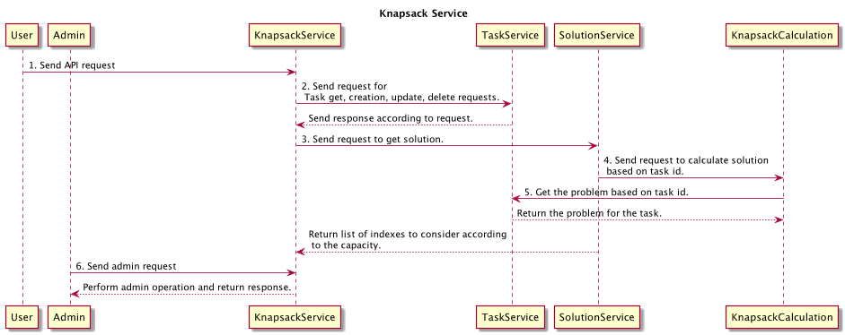

#Knapsack problem
The knapsack problem or rucksack problem is a problem in combinatorial optimization: Given a set of items, each with a 
weight and a value, determine the number of each item to include in a collection so that the total weight is less than 
or equal to a given limit and the total value is as large as possible. [Wikipedia](https://en.wikipedia.org/wiki/Knapsack_problem)

### Algorithm applied to calculate the solution
The logic for this algorithm is:
1. Calculate the ratio of value and weight
2. Sort these ratios in descending order.
3. Check the list and see how many weights from the sorted list can be accommodated within the capacity provided.
4. Return indexes of the weights which were accommodated within the capacity.

I am using ListBuffer to store the task and problem. This logic can be replaced with any persistent layer using database.
For that purpose DAO support can be added in this solution. 

### Minimum requirements
* Scala version `2.12.6`
* JVM `1.8`
* sbt `1.2.1`
* Import this project in any IDE e.g. Intellij IDEA or eclipse.

### How to run the project?
* In the terminal goto project directly and execute `sbt run` 
* To start the application in a docker container use `docker-compose up`
  
  Application with start with default port: 8080
  
  p.s.: Please execute `sbt assembly` first then start the docker with docker-compose. 

### Rest Endpoints
Number of Rest endpoints are provided in this application. Basic authentication is added using username (`authentic-admin`) 
and password  (`password`) for admin tasks.
* `POST` request to create a task: `http://localhost:8080/knapsack/tasks`

    ```
    Sample body:
    {
      "problem": {
        "capacity": 60,
        "weights": [10, 20, 33],
        "values": [10, 3, 30]
      }
    }
    ```

* `GET` request to get a task: `http://localhost:8080/knapsack/tasks/{taskId}`

`404 will be returned if task not found.`
* `GET` request to get all tasks: `http://localhost:8080/knapsack/admin/tasks`
* `DELETE` request to delete a task: `http://localhost:8080/knapsack/tasks/{taskId}`
* `PATCH` request to update the status of the task: `http://localhost:8080/knapsack/admin/update-status/{taskId}`
      
    ```
    Sample body:
    {
      "status": "Completed"
    }
    ```

* `GET` request to get solution of the problem: `http://localhost:8080/knapsack/solutions/{taskId}`
* `GET` request to get status of the application: `http://localhost:8080/knapsack/admin/status`
* `POST` request to shutdown the system: `http://localhost:8080/knapsack/admin/shutdown`

### Sequence diagram for knapsack app


### Architecture description
This project is using Akka HTTP for REST API for asynchronous calls.

Akka has number of benefits over other tools like Spray, Play etc [[1]](https://dzone.com/articles/akka-http-vs-other-rest-api-tools)
* Akka HTTP has better default configurations, like thread pool size, for optimal performance.
* Akka HTTP allows the database connection pool to expand and scale out more efficiently for better throughput.
* Akka HTTP has very good documentation.
* Akka HTTP has multiple levels of APIs available to allow flexibility and ease of development.
